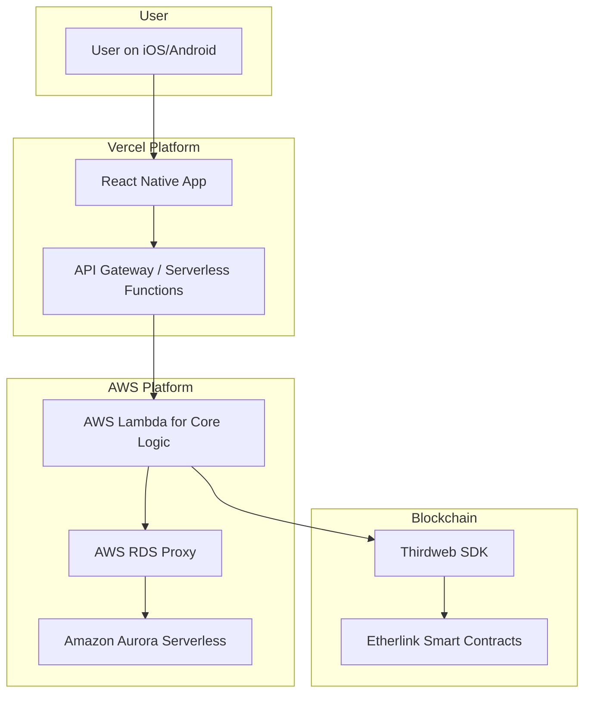
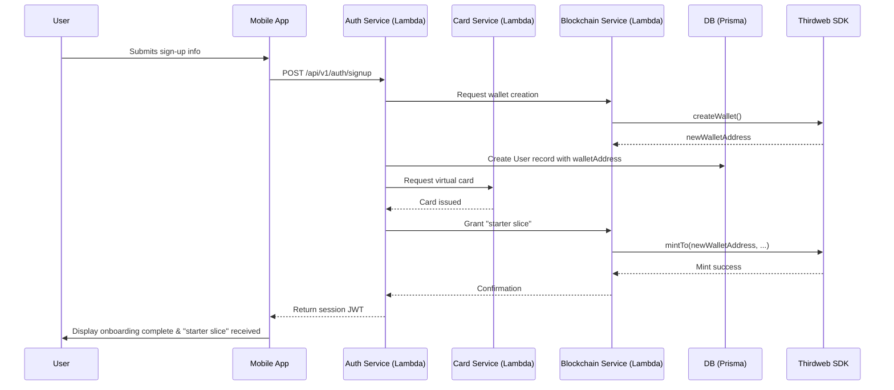
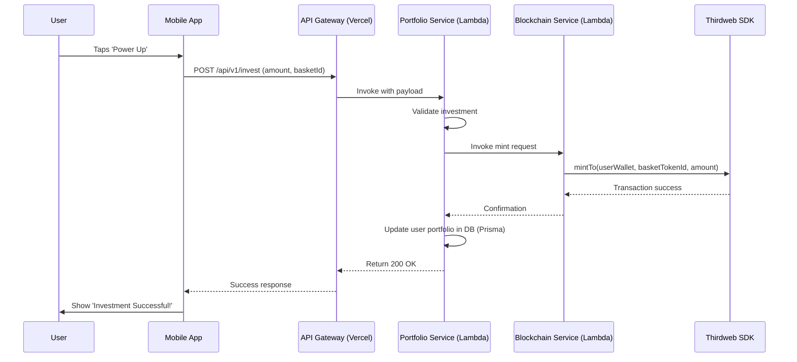
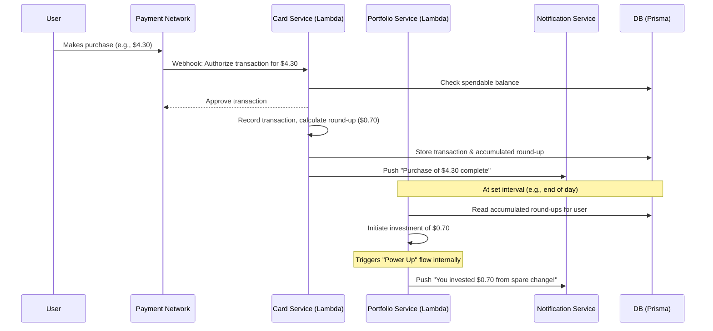
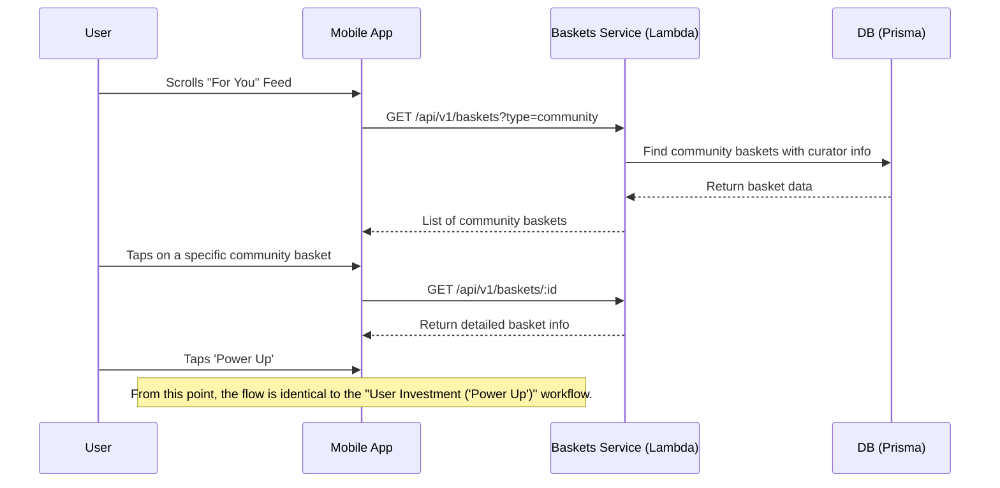
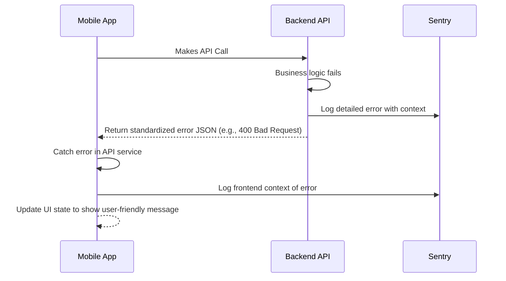

# **STACK Fullstack Architecture Document**

## **Introduction**

This document outlines the complete fullstack architecture for STACK, including backend systems, frontend implementation, and their integration. It serves as the single source of truth for AI-driven development, ensuring consistency across the entire technology stack.

The project will be scaffolded from scratch using the technologies defined herein.

## **High Level Architecture**

### **Technical Summary**

STACK will be a fullstack, serverless, mobile-first application built on the Etherlink blockchain ecosystem. The architecture is housed in a monorepo and features a React Native frontend, a serverless backend connecting to an **Amazon Aurora Serverless** database via the **Prisma ORM**, and smart contracts managed via the Thirdweb SDK. This design directly supports the product's goals of creating a simple, gamified, and highly engaging user experience with flexible data querying.

### **Platform and Infrastructure Choice**

  * **Platform**: A hybrid approach using **Vercel** and **AWS**.
  * **Key Services**:
      * **Vercel**: For hosting the React Native web/API layer and providing preview deployments.
      * **AWS Lambda**: For intensive backend business logic.
      * **Amazon Aurora Serverless (PostgreSQL)**: For our primary relational database.
      * **AWS RDS Proxy**: To efficiently manage database connections from our Lambda functions.
  * **Rationale**: This combination offers a best-in-class developer experience for the frontend (Vercel) while leveraging the power of AWS for a scalable, relational backend.

### **Repository Structure**

  * **Structure**: **Monorepo**.
  * **Monorepo Tool**: **Turborepo** is recommended for its high-performance build system.
  * **Rationale**: A monorepo is ideal for managing shared code and types between the mobile app, backend, and smart contracts, as outlined in the PRD.

### **High Level Architecture Diagram**



### **Architectural Patterns**

  * **Serverless Architecture**: The entire backend will be event-driven and run in a serverless environment.
  * **Component-Based UI**: The React Native frontend will be built using a modular, reusable component architecture.
  * **API Gateway**: Vercel's serverless functions will act as a gateway, routing requests to the appropriate backend AWS Lambda services.
  * **Repository Pattern**: Backend services will use the repository pattern, implemented with **Prisma**, to abstract data access logic.

-----

## **Tech Stack**

#### **Technology Stack Table**

| Category | Technology | Version | Purpose | Rationale |
| :--- | :--- | :--- | :--- | :--- |
| **Frontend Language** | TypeScript | 5.4+ | Primary language for the mobile app | Provides strong typing to reduce bugs and improve developer experience. |
| **Frontend Framework**| Expo (React Native) | SDK 51+ | Core framework for building the iOS & Android app | Fulfills the PRD requirement for a cross-platform mobile framework. |
| **Styling** | NativeWind | 4.0+ | Utility-first CSS for React Native | Allows for rapid styling using Tailwind CSS conventions. |
| **State Management** | Zustand | 4.5+ | Global state management | A simple, lightweight, and powerful alternative to Redux, ideal for an MVP. |
| **Backend Language** | TypeScript | 5.4+ | Primary language for the serverless backend | Maintains language consistency across the monorepo for shared code and types. |
| **Backend Framework**| Express.js | 4.18+ | API framework for serverless functions | Lightweight, unopinionated, and the industry standard for building Node.js APIs. |
| **API Style** | REST API | N/A | API communication standard | The most widely understood and supported standard for client-server communication. |
| **Database** | Amazon Aurora Serverless | v2 (PostgreSQL 15+) | Primary relational database | Provides a scalable, serverless SQL database that is a natural fit for our relational data model. |
| **ORM** | Prisma | 5.10+ | Type-safe database client | Offers an excellent developer experience and type safety when interacting with our PostgreSQL database. |
| **Authentication** | Thirdweb Auth | Latest | User authentication and wallet management | Web3-native solution that simplifies wallet-based login and session management. |
| **Blockchain SDK** | Thirdweb SDK | Latest | Interacting with Etherlink smart contracts | Simplifies all blockchain interactions, aligning with PRD requirements. |
| **Frontend Testing**| Jest & RNTL | 29.7+ | Unit & component testing for the mobile app | The standard testing stack for React Native. |
| **Backend Testing** | Jest & Supertest | 29.7+ | Unit & integration testing for the API | Standard tools for testing Node.js services. |
| **E2E Testing** | Playwright | 1.44+ | End-to-end testing across the application | A modern, powerful tool for automating real user scenarios. |
| **Build & Deploy** | EAS Build & Vercel | Latest | Building the mobile app & deploying the API | EAS is Expo's cloud build service. Vercel provides seamless deployment for the API gateway. |
| **CI/CD** | GitHub Actions | N/A | Continuous Integration & Deployment pipeline | Tightly integrated with GitHub, perfect for automating tests and deployments. |
| **Error Tracking** | Sentry | Latest | Frontend and backend error monitoring | Provides real-time error tracking and performance monitoring. |
| **Infrastructure** | AWS CDK | 2.140+ | Infrastructure as Code for AWS resources | Allows us to define our AWS infrastructure (Aurora, RDS Proxy, Lambda) using TypeScript. |

-----

## **Data Models**

#### **Prisma Schema**

This schema will be the single source of truth for our database tables and will automatically generate the TypeScript types used in our code.

```prisma
datasource db {
  provider = "postgresql"
  url      = env("DATABASE_URL")
}

generator client {
  provider = "prisma-client-js"
}

// --- DATA MODELS ---

model User {
  id              String    @id @default(cuid())
  email           String?   @unique
  walletAddress   String    @unique
  displayName     String
  avatarUrl       String?
  bio             String?
  isCurator       Boolean   @default(false)
  createdAt       DateTime  @default(now())
  updatedAt       DateTime  @updatedAt

  portfolio       Portfolio?
  virtualCard     VirtualCard?
  loans           Loan[]
  createdBaskets  Basket[]      @relation("CuratedBy")
  transactions    Transaction[]
  // Gamification relationships
  userQuests      UserQuest[]
  battlePassProgress UserBattlePass[]
  // AI Expert relationships
  tipInteractions UserTipInteraction[]
  // Personalization relationships
  preferences     UserPreference?
  feedInteractions UserFeedInteraction[]
  // Automation relationships
  investmentSchedules InvestmentSchedule[]
  autoInvestments AutoInvestment[]
  // Notification relationships
  notifications   Notification[]
}

model Portfolio {
  id          String    @id @default(cuid())
  totalValue  Decimal   @default(0)
  user        User      @relation(fields: [userId], references: [id])
  userId      String    @unique
  holdings    PortfolioHolding[]
}

model PortfolioHolding {
  id                    String    @id @default(cuid())
  unitsOwned            Decimal
  totalAmountInvested   Decimal
  currentValue          Decimal
  portfolio             Portfolio @relation(fields: [portfolioId], references: [id])
  portfolioId           String
  basket                Basket    @relation(fields: [basketId], references: [id])
  basketId              String
  @@unique([portfolioId, basketId])
}

model Basket {
  id            String    @id @default(cuid())
  name          String
  description   String
  iconUrl       String?
  riskLevel     RiskLevel @default(MEDIUM)
  assets        Json
  isCommunity   Boolean   @default(false)
  createdAt     DateTime  @default(now())
  updatedAt     DateTime  @updatedAt
  curator       User?     @relation("CuratedBy", fields: [curatorId], references: [id])
  curatorId     String?
  holdings      PortfolioHolding[]
  // Automation relationships
  schedules     InvestmentSchedule[]
  autoInvestments AutoInvestment[]
}

model VirtualCard {
  id                   String     @id @default(cuid())
  spendableBalance     Decimal    @default(0)
  cardProcessorToken   String     @unique
  status               CardStatus @default(ACTIVE)
  roundUpSettings      Json
  spendingLimits       Json
  securitySettings     Json
  notificationSettings Json
  user                 User       @relation(fields: [userId], references: [id])
  userId               String     @unique
}

model Transaction {
  id          String            @id @default(cuid())
  amount      Decimal
  currency    String            @default("USD")
  type        TransactionType
  status      TransactionStatus @default(PENDING)
  description String
  metadata    Json?
  createdAt   DateTime          @default(now())
  updatedAt   DateTime          @updatedAt
  user        User              @relation(fields: [userId], references: [id])
  userId      String
}

model Loan {
  id                 String      @id @default(cuid())
  principalAmount    Decimal
  outstandingBalance Decimal
  interestRate       Decimal
  status             LoanStatus  @default(ACTIVE)
  collateral         Json
  createdAt          DateTime    @default(now())
  updatedAt          DateTime    @updatedAt
  user               User        @relation(fields: [userId], references: [id])
  userId             String
}

// --- GAMIFICATION MODELS ---

model Quest {
  id              String      @id @default(cuid())
  title           String
  description     String
  type            QuestType
  targetValue     Decimal?
  targetCount     Int?
  rewardType      RewardType
  rewardValue     Decimal?
  isActive        Boolean     @default(true)
  createdAt       DateTime    @default(now())
  updatedAt       DateTime    @updatedAt
  userQuests      UserQuest[]
}

model UserQuest {
  id              String      @id @default(cuid())
  progress        Decimal     @default(0)
  isCompleted     Boolean     @default(false)
  completedAt     DateTime?
  claimedAt       DateTime?
  user            User        @relation(fields: [userId], references: [id])
  userId          String
  quest           Quest       @relation(fields: [questId], references: [id])
  questId         String
  @@unique([userId, questId])
}

model BattlePass {
  id              String      @id @default(cuid())
  season          String
  startDate       DateTime
  endDate         DateTime
  isActive        Boolean     @default(true)
  tiers           Json        // Array of tier definitions with XP requirements and rewards
  createdAt       DateTime    @default(now())
  updatedAt       DateTime    @updatedAt
  userProgress    UserBattlePass[]
}

model UserBattlePass {
  id              String      @id @default(cuid())
  currentXP       Int         @default(0)
  currentTier     Int         @default(1)
  claimedTiers    Json        @default("[]") // Array of claimed tier numbers
  user            User        @relation(fields: [userId], references: [id])
  userId          String
  battlePass      BattlePass  @relation(fields: [battlePassId], references: [id])
  battlePassId    String
  @@unique([userId, battlePassId])
}

// --- AI EXPERT MODELS ---

model ExpertTip {
  id              String      @id @default(cuid())
  title           String
  content         String
  category        TipCategory
  triggerEvent    TriggerEvent
  isActive        Boolean     @default(true)
  createdAt       DateTime    @default(now())
  updatedAt       DateTime    @updatedAt
  userInteractions UserTipInteraction[]
}

model UserTipInteraction {
  id              String      @id @default(cuid())
  wasShown        Boolean     @default(false)
  wasRead         Boolean     @default(false)
  wasHelpful      Boolean?
  shownAt         DateTime?
  readAt          DateTime?
  feedbackAt      DateTime?
  user            User        @relation(fields: [userId], references: [id])
  userId          String
  tip             ExpertTip   @relation(fields: [tipId], references: [id])
  tipId           String
  @@unique([userId, tipId])
}

// --- PERSONALIZATION MODELS ---

model UserPreference {
  id              String      @id @default(cuid())
  riskTolerance   RiskLevel   @default(MEDIUM)
  investmentGoals Json        // Array of goal types
  interests       Json        // Array of interest categories
  notificationSettings Json
  user            User        @relation(fields: [userId], references: [id])
  userId          String      @unique
}

model FeedItem {
  id              String      @id @default(cuid())
  type            FeedItemType
  title           String
  description     String?
  imageUrl        String?
  targetId        String      // ID of basket, quest, etc.
  priority        Int         @default(0)
  isActive        Boolean     @default(true)
  createdAt       DateTime    @default(now())
  updatedAt       DateTime    @updatedAt
  userInteractions UserFeedInteraction[]
}

model UserFeedInteraction {
  id              String      @id @default(cuid())
  wasShown        Boolean     @default(false)
  wasClicked      Boolean     @default(false)
  wasInvested     Boolean     @default(false)
  shownAt         DateTime?
  clickedAt       DateTime?
  investedAt      DateTime?
  user            User        @relation(fields: [userId], references: [id])
  userId          String
  feedItem        FeedItem    @relation(fields: [feedItemId], references: [id])
  feedItemId      String
  @@unique([userId, feedItemId])
}

// --- AUTOMATION MODELS ---

model InvestmentSchedule {
  id              String      @id @default(cuid())
  amount          Decimal
  frequency       ScheduleFrequency
  dayOfWeek       Int?        // 0-6 for weekly schedules
  dayOfMonth      Int?        // 1-31 for monthly schedules
  isActive        Boolean     @default(true)
  nextRunDate     DateTime
  lastRunDate     DateTime?
  user            User        @relation(fields: [userId], references: [id])
  userId          String
  basket          Basket      @relation(fields: [basketId], references: [id])
  basketId        String
  createdAt       DateTime    @default(now())
  updatedAt       DateTime    @updatedAt
}

model AutoInvestment {
  id              String      @id @default(cuid())
  amount          Decimal
  type            AutoInvestmentType
  status          AutoInvestmentStatus @default(PENDING)
  scheduledFor    DateTime
  executedAt      DateTime?
  failureReason   String?
  user            User        @relation(fields: [userId], references: [id])
  userId          String
  basket          Basket      @relation(fields: [basketId], references: [id])
  basketId        String
  schedule        InvestmentSchedule? @relation(fields: [scheduleId], references: [id])
  scheduleId      String?
  createdAt       DateTime    @default(now())
  updatedAt       DateTime    @updatedAt
}

// --- NOTIFICATION MODELS ---

model Notification {
  id              String      @id @default(cuid())
  title           String
  message         String
  type            NotificationType
  data            Json?       // Additional data for the notification
  isRead          Boolean     @default(false)
  readAt          DateTime?
  user            User        @relation(fields: [userId], references: [id])
  userId          String
  createdAt       DateTime    @default(now())
  updatedAt       DateTime    @updatedAt
}

enum RiskLevel { LOW, MEDIUM, HIGH }
enum CardStatus { ACTIVE, INACTIVE, FROZEN }
enum TransactionType { CARD_PURCHASE, INVESTMENT, WITHDRAWAL, LOAN_DISBURSEMENT, LOAN_REPAYMENT, FEE }
enum TransactionStatus { PENDING, COMPLETED, FAILED, REVERSED }
enum LoanStatus { ACTIVE, REPAID, IN_DEFAULT, LIQUIDATED }
enum QuestType { INVESTMENT_AMOUNT, INVESTMENT_COUNT, CARD_USAGE, SOCIAL_ACTION, STREAK }
enum RewardType { XP, BONUS_INVESTMENT, COSMETIC, DISCOUNT }
enum TipCategory { INVESTMENT_STRATEGY, MARKET_INSIGHT, FINANCIAL_EDUCATION, PLATFORM_FEATURE }
enum TriggerEvent { POST_INVESTMENT, MARKET_MOVEMENT, QUEST_COMPLETION, WEEKLY_SUMMARY }
enum FeedItemType { BASKET_RECOMMENDATION, QUEST_SUGGESTION, CURATOR_HIGHLIGHT, MARKET_UPDATE }
enum ScheduleFrequency { WEEKLY, BIWEEKLY, MONTHLY }
enum AutoInvestmentType { PAYDAY, ROUNDUP, SCHEDULED }
enum AutoInvestmentStatus { PENDING, COMPLETED, FAILED, CANCELLED }
enum NotificationType { INVESTMENT_SUCCESS, QUEST_COMPLETED, MARKET_UPDATE, SYSTEM_ALERT }
```

-----

## **API Specification**

The API will be a REST API defined by the OpenAPI 3.0 standard.

### **REST API Specification**

#### **Authentication**
- `POST /auth/login` - User login with wallet
- `POST /auth/refresh` - Refresh JWT token
- `POST /auth/logout` - User logout

#### **User Management**
- `GET /users/profile` - Get user profile
- `PUT /users/profile` - Update user profile
- `GET /users/preferences` - Get user preferences
- `PUT /users/preferences` - Update user preferences

#### **Baskets & Investments**
- `GET /baskets` - List all available baskets
- `GET /baskets/:id` - Get basket details
- `POST /baskets/:id/invest` - Invest in a basket ("Power Up")
- `GET /baskets/curated` - Get community-curated baskets
- `POST /baskets` - Create a new basket (curator only)
- `PUT /baskets/:id` - Update basket (curator only)

#### **Portfolio Management**
- `GET /portfolio` - Get user's portfolio
- `GET /portfolio/holdings` - Get detailed holdings
- `GET /portfolio/performance` - Get portfolio performance metrics

#### **Gamification**
- `GET /quests` - Get available quests
- `GET /quests/user` - Get user's quest progress
- `POST /quests/:id/claim` - Claim quest reward
- `GET /battlepass` - Get current battle pass
- `GET /battlepass/progress` - Get user's battle pass progress
- `POST /battlepass/claim/:tier` - Claim battle pass tier reward

#### **AI Expert Tips**
- `GET /tips` - Get personalized tips
- `POST /tips/:id/interaction` - Record tip interaction (shown/read/helpful)
- `GET /tips/categories` - Get tip categories

#### **"For You" Feed**
- `GET /feed` - Get personalized feed items
- `POST /feed/:id/interaction` - Record feed interaction (shown/clicked/invested)

#### **Automation**
- `GET /automation/schedules` - Get user's investment schedules
- `POST /automation/schedules` - Create investment schedule (payday/recurring)
- `PUT /automation/schedules/:id` - Update investment schedule
- `DELETE /automation/schedules/:id` - Delete investment schedule
- `GET /automation/roundup` - Get round-up settings
- `PUT /automation/roundup` - Update round-up settings
- `GET /automation/history` - Get auto-investment history

#### **Virtual Cards**
- `GET /cards` - Get user's virtual cards
- `POST /cards` - Issue new virtual card
- `PUT /cards/:id/status` - Update card status (freeze/unfreeze)
- `GET /cards/:id/transactions` - Get card transaction history

#### **Transactions**
- `GET /transactions` - Get transaction history
- `GET /transactions/:id` - Get transaction details

#### **Micro-loans**
- `GET /loans` - Get user's loans
- `POST /loans/request` - Request a micro-loan
- `POST /loans/:id/repay` - Make loan repayment
- `GET /loans/eligibility` - Check loan eligibility

#### **Notifications**
- `GET /notifications` - Get user notifications
- `PUT /notifications/:id/read` - Mark notification as read
- `PUT /notifications/read-all` - Mark all notifications as read

#### **Community & Curators**
- `GET /curators` - Get list of curators
- `GET /curators/:id/profile` - Get curator profile
- `POST /curators/apply` - Apply to become a curator
- `GET /curators/:id/baskets` - Get baskets by curator

```yaml
openapi: 3.0.0
info:
  title: "STACK API"
  version: "1.0.0"
  description: "API for the STACK Gen Z Web3 Investment Platform"
servers:
  - url: "/api/v1"
components:
  securitySchemes:
    bearerAuth:
      type: http
      scheme: bearer
      bearerFormat: JWT
security:
  - bearerAuth: []
paths:
  /auth/login:
    post:
      summary: "User Login"
      description: "Authenticates a user via a signed wallet message and returns a session JWT."
  /baskets:
    get:
      summary: "List Baskets"
      description: "Retrieves a list of all available investment Baskets."
  /portfolio/invest:
    post:
      summary: "Make an Investment (Power Up)"
      description: "Invests a specified amount into a Basket for the authenticated user."
```

-----

## **Components**

  * **Frontend Mobile App**: The Expo (React Native) application providing the complete user interface.
  * **API Gateway**: Vercel Serverless Functions acting as the secure entry point for all client requests.
  * **Authentication Service**: An AWS Lambda function managing user sign-up, login, and session tokens.
  * **Blockchain Service**: An AWS Lambda function that is the sole intermediary with the Thirdweb SDK and Etherlink smart contracts.
  * **Portfolio & Baskets Service**: An AWS Lambda function managing the business logic for investments.
  * **Card & Loan Service**: An AWS Lambda function managing virtual cards, transactions, and loans via the VertoFX API.

-----

## **External APIs**

  * **Thirdweb SDK & APIs**: For all blockchain interactions.
  * **VertoFX API**: For multi-currency wallets and virtual card issuing.
  * **AI Platform (e.g., Google Gemini)**: To power the AI Financial Expert.
  * **Notification Service (e.g., AWS SNS)**: To handle all user-facing push notifications.

-----

## **Core Workflows**

This section illustrates the sequence of interactions for the most critical user journeys in the STACK application.

### **High-Level Workflow Overview**

#### **1. New User Onboarding & Free Slice**
1. User downloads app and creates account
2. Wallet is automatically created via Thirdweb Auth
3. User completes onboarding flow (risk assessment, preferences)
4. System issues virtual debit card
5. User receives free "starter slice" investment
6. Initial quests and battle pass are activated

#### **2. User Investment ("Power Up")**
1. User browses baskets on "For You" feed or basket list
2. User selects basket and views details
3. User chooses investment amount and confirms
4. Payment is processed via smart contract
5. Portfolio holdings are updated
6. Investment triggers quest progress and XP gain
7. AI expert tip is shown post-investment

#### **3. Card Purchase & Round-Up Investment**
1. User makes purchase with virtual card
2. Transaction is processed and recorded
3. Round-up amount is calculated (if enabled)
4. Round-up is automatically invested in selected basket
5. User receives notification of round-up investment
6. Quest progress is updated for card usage

#### **4. Investing in a Community-Created Basket**
1. User discovers curator-created basket
2. User views curator profile and basket details
3. User invests in the basket
4. Curator receives notification of new investment
5. Community engagement metrics are updated

#### **5. Payday Automated Investment**
1. User sets up payday investment schedule
2. System monitors for salary deposits
3. On payday detection, scheduled investment is triggered
4. Investment is automatically executed
5. User receives confirmation notification
6. Quest progress is updated for automated investing

#### **6. Quest Completion & Battle Pass Progression**
1. User performs actions that contribute to quest progress
2. System tracks progress and updates quest status
3. When quest is completed, user is notified
4. User claims quest reward (XP, bonus investment, etc.)
5. XP is added to battle pass progression
6. Battle pass tier rewards become available for claiming

#### **7. AI Expert Tip Delivery**
1. System analyzes user behavior and market conditions
2. Relevant tips are selected based on trigger events
3. Tips are delivered at optimal moments (post-investment, market changes)
4. User interaction with tips is tracked
5. Tip effectiveness is measured for personalization

#### **8. "For You" Feed Personalization**
1. System analyzes user preferences, behavior, and portfolio
2. Feed items are ranked by relevance and engagement probability
3. Personalized feed is generated with baskets, quests, and updates
4. User interactions are tracked for feed optimization
5. Machine learning models are updated based on engagement

#### **9. Micro-loan Request & Approval**
1. User views portfolio as collateral
2. User requests micro-loan with specified amount
3. System evaluates loan eligibility based on portfolio value
4. Loan is approved/denied and user is notified
5. If approved, funds are disbursed to user's account
6. Repayment schedule is established

#### **10. Community Curator Application**
1. User applies to become a community curator
2. Application is reviewed (automated + manual review)
3. User is approved/denied curator status
4. Approved curators can create and publish baskets
5. Curator performance is tracked and displayed

### **Detailed Sequence Diagrams**

#### **1. New User Onboarding & Free Slice**

This flow covers the initial user sign-up, automatic wallet creation, virtual card issuance, and the reception of the "free starter slice" to engage the user immediately.



#### **2. User Investment ("Power Up")**

This is the core investment loop, where a user invests their own funds into a chosen Basket.



#### **3. Card Purchase & Round-Up Investment**

This flow details how a real-world purchase with the STACK card automatically triggers a micro-investment from the user's spare change.



#### **4. Investing in a Community-Created Basket**

This flow shows a user discovering and investing in a basket created by another community member, highlighting the social aspect of the platform. The initial discovery steps are shown, after which the investment process follows the standard "Power Up" workflow.



-----

## **Database Schema**

The database schema is definitively defined by the Prisma Schema in the "Data Models" section. The `prisma migrate` command will be used to generate and apply SQL migrations to our PostgreSQL database, ensuring the schema is always in sync with our models.

-----

## **Frontend & Backend Architecture**

### **Frontend (React Native / Expo)**

  * **Folder Structure**:
    ```
    apps/mobile-app/
    ├── src/
    │   ├── api/          # API service definitions
    │   ├── components/   # Reusable UI components (ui/ & domain/)
    │   ├── hooks/        # Custom React hooks
    │   ├── navigation/   # React Navigation setup
    │   ├── screens/      # Top-level screen components
    │   ├── store/        # Zustand state management stores
    │   └── styles/       # Global styles, themes, NativeWind config
    └── app.json
    ```
  * **Component Template**:
    ```typescript
    // src/components/ui/MyComponent.tsx
    import { View, Text } from 'react-native';
    import { styled } from 'nativewind';

    const StyledView = styled(View);
    const StyledText = styled(Text);

    interface MyComponentProps {
      title: string;
    }

    export const MyComponent = ({ title }: MyComponentProps) => {
      return (
        <StyledView className="p-4 bg-neutral-light rounded-lg">
          <StyledText className="text-white font-bold">{title}</StyledText>
        </StyledView>
      );
    };
    ```

### **Backend (Express on Vercel/Lambda)**

  * **Folder Structure**:
    ```
    apps/backend-api/
    ├── src/
    │   ├── api/          # Vercel serverless function handlers
    │   ├── services/     # Core business logic
    │   ├── lib/          # Shared utilities (e.g., Prisma client)
    │   └── types/        # API-specific types
    └── vercel.json
    ```
  * **Service Template**:
    ```typescript
    // src/services/basketService.ts
    import { prisma } from '../lib/prisma';

    export const getBaskets = async () => {
      return await prisma.basket.findMany({
        where: { isCommunity: false },
      });
    };
    ```

-----

## **Unified Project Structure**

```mermaid
graph TD
    subgraph Monorepo (Turborepo)
        A(apps)
        B(packages)
        C(package.json)
        D(turbo.json)
    end

    subgraph apps
        direction LR
        A1(mobile-app)
        A2(backend-api)
    end

    subgraph packages
        direction LR
        B1(contracts)
        B2(shared-types)
        B3(ui-library)
        B4(eslint-config)
    end

    A --> A1 & A2
    B --> B1 & B2 & B3 & B4
```

-----

## **Development Workflow**

  * **Prerequisites**: Node.js, pnpm, Docker.
  * **Initial Setup**: `pnpm install`
  * **Development Commands**:
      * Start all services: `pnpm dev`
      * Start frontend only: `pnpm dev --filter=mobile-app`
      * Start backend only: `pnpm dev --filter=backend-api`
      * Run all tests: `pnpm test`

-----

## **Deployment Architecture**

  * **Frontend Deployment**: The React Native app will be built using **Expo Application Services (EAS) Build** and submitted to the Apple App Store and Google Play Store.
  * **Backend Deployment**: The `backend-api` will be deployed to **Vercel**. Each commit to the `main` branch will trigger a production deployment via GitHub Actions.
  * **CI/CD Pipeline**: A `deploy.yml` file in GitHub Actions will run tests, linting, and then trigger both the `vercel --prod` command and the AWS CDK deployment for backend resources.

-----

## **Security and Performance**

  * **Security**:
      * All API traffic will be over HTTPS.
      * Authentication will use JWTs provided by Thirdweb Auth.
      * Backend services will use AWS IAM roles with least-privilege permissions.
      * All user input will be validated on the backend using a library like **Zod**.
  * **Performance**:
      * **Frontend**: NativeWind minimizes bundle size. We will use `React.lazy` for component loading and optimize image assets.
      * **Backend**: AWS Lambda ensures scalability. The RDS Proxy will manage database connections efficiently. API responses will be cached where appropriate.

-----

## Testing Strategy

This section formalizes our commitment to the "Full Testing Pyramid" we agreed on earlier. It will define the types of tests we'll write, where they will live in our monorepo, and provide clear examples for our developers.

#### Testing Pyramid

Our strategy is based on the Testing Pyramid. We will write many fast unit tests at the base, a healthy number of integration tests in the middle, and a few, high-value end-to-end tests at the top to ensure quality and reliability.

```plaintext
      /      \
   End-to-End Tests
  /----------------\
 Integration Tests
/------------------\
   Unit Tests
```

#### Test Organization

  * **Frontend Tests (`apps/mobile-app`):**
      * **Unit/Component Tests (`*.test.tsx`):** Will be co-located with the component files they are testing.
      * **E2E Tests (`e2e/`):** A dedicated folder at the root of the mobile app package will contain our Playwright end-to-end test suites.
  * **Backend Tests (`apps/backend-api`):**
      * **Unit Tests (`*.test.ts`):** Will be co-located with the service and utility files they test.
      * **Integration Tests (`__tests__/`):** A dedicated folder will be used for tests that require a live database connection or test the integration between multiple services.
  * **Smart Contract Tests (`packages/contracts`):**
      * Tests will be written using Foundry or Hardhat and will live within the `contracts` package, following the standard practices for those tools.

#### Test Examples

##### Frontend Component Test (Jest & React Native Testing Library)

```typescript
// src/components/ui/Button.test.tsx
import { render, fireEvent } from '@testing-library/react-native';
import { Button } from './Button';

it('calls onPress when tapped', () => {
  const onPressMock = jest.fn();
  const { getByText } = render(<Button title="Test" onPress={onPressMock} />);

  fireEvent.press(getByText('Test'));

  expect(onPressMock).toHaveBeenCalledTimes(1);
});
```

##### Backend API Test (Jest & Supertest)

```typescript
// src/functions/baskets/getBaskets.test.ts
import request from 'supertest';
import { app } from '../../app'; // Assuming a central Express app instance for testing

it('returns a list of baskets', async () => {
  const response = await request(app)
    .get('/api/v1/baskets')
    .set('Authorization', 'Bearer <test_token>');

  expect(response.status).toBe(200);
  expect(response.body).toBeInstanceOf(Array);
});
```

##### E2E Test (Playwright)

```typescript
// e2e/investment.spec.ts
import { test, expect } from '@playwright/test';

test('New user can make their first investment', async ({ page }) => {
  // 1. Login
  await page.goto('/login');
  // ... steps to log in

  // 2. Navigate to a basket
  await page.getByTestId('dashboard-feed').waitFor();
  await page.getByText('Gamer Basket').click();

  // 3. Make an investment
  await page.getByRole('button', { name: 'Power Up' }).click();
  await page.getByPlaceholder('Amount').fill('10');
  await page.getByRole('button', { name: 'Confirm Investment' }).click();

  // 4. Verify success
  await expect(page.getByText('Investment Successful!')).toBeVisible();
});
```

-----

## **Coding Standards**

  * **Critical Rules**:
      * NEVER commit secret keys or environment variables to the repository.
      * All API routes must have input validation using Zod.
      * All frontend components must be styled using NativeWind classes.
      * Shared types must be defined in the `packages/shared-types` directory and imported from there.
  * **Naming Conventions**:
      * **Components**: `PascalCase.tsx` (e.g., `UserProfile.tsx`)
      * **Hooks**: `useCamelCase.ts` (e.g., `useAuth.ts`)
      * **API Files**: `camelCase.ts` (e.g., `getBaskets.ts`)
      * **Services**: `camelCaseService.ts` (e.g., `portfolioService.ts`)

-----

## **Error Handling Strategy**

A unified error handling strategy will be implemented to ensure consistency and provide clear, actionable feedback to both users and developers.



  * **Standard Error Format**:
    ```json
    {
      "error": {
        "code": "INVESTMENT_FAILED",
        "message": "Insufficient funds for this Power Up.",
        "requestId": "cuid_12345"
      }
    }
    ```
  * **Backend Middleware**: A global error handling middleware in Express will catch all unhandled exceptions and format them into the standard error response.
  * **Frontend Handling**: A wrapper around the API client will handle responses, directing successful ones to the application logic and failed ones to the error state management.

-----

## **Monitoring and Observability**

  * **Monitoring Stack**:
      * **Error Tracking**: Sentry will be used for both frontend and backend error tracking.
      * **Backend Logs**: AWS CloudWatch will be used for all Lambda function logs.
      * **API Performance**: Vercel Analytics will monitor API gateway latency and traffic.
  * **Key Metrics**:
      * **Business**: Daily Active Users, Number of "Power Ups", Total Amount Invested.
      * **Performance**: API p95 Latency, App Start Time, Transaction Throughput.
      * **Health**: API Error Rate (%), Crash-free sessions (%).
