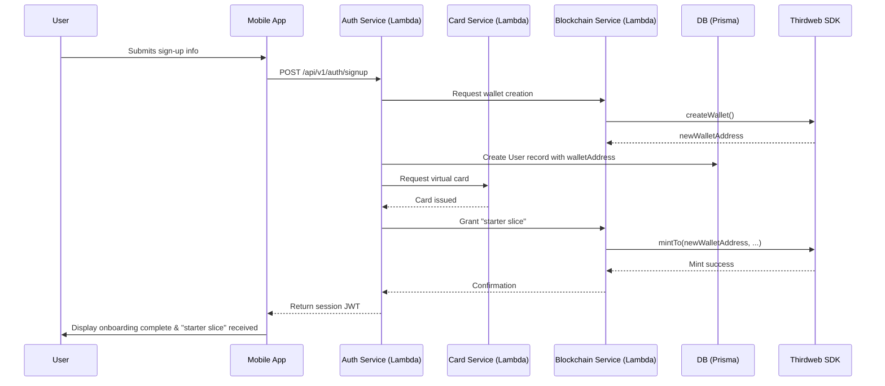
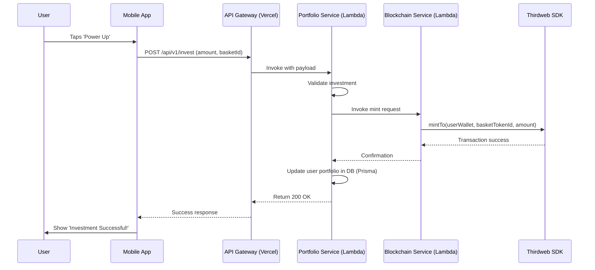
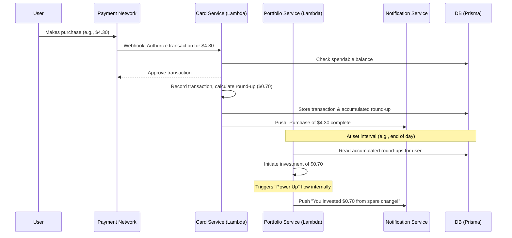
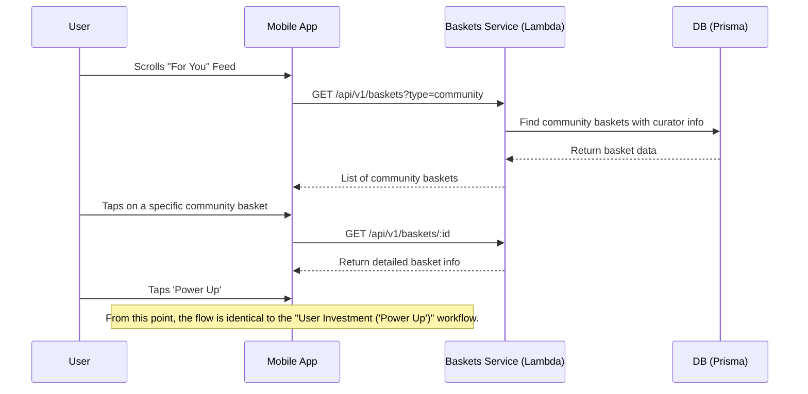

# **Core Workflows**

This section illustrates the sequence of interactions for the most critical user journeys in the STACK application.

## **High-Level Workflow Overview**

### **1. New User Onboarding & Free Slice**
1. User downloads app and creates account
2. Wallet is automatically created via Thirdweb Auth
3. User completes onboarding flow (risk assessment, preferences)
4. System issues virtual debit card
5. User receives free "starter slice" investment
6. Initial quests and battle pass are activated

### **2. User Investment ("Power Up")**
1. User browses baskets on "For You" feed or basket list
2. User selects basket and views details
3. User chooses investment amount and confirms
4. Payment is processed via smart contract
5. Portfolio holdings are updated
6. Investment triggers quest progress and XP gain
7. AI expert tip is shown post-investment

### **3. Card Purchase & Round-Up Investment**
1. User makes purchase with virtual card
2. Transaction is processed and recorded
3. Round-up amount is calculated (if enabled)
4. Round-up is automatically invested in selected basket
5. User receives notification of round-up investment
6. Quest progress is updated for card usage

### **4. Investing in a Community-Created Basket**
1. User discovers curator-created basket
2. User views curator profile and basket details
3. User invests in the basket
4. Curator receives notification of new investment
5. Community engagement metrics are updated

### **5. Payday Automated Investment**
1. User sets up payday investment schedule
2. System monitors for salary deposits
3. On payday detection, scheduled investment is triggered
4. Investment is automatically executed
5. User receives confirmation notification
6. Quest progress is updated for automated investing

### **6. Quest Completion & Battle Pass Progression**
1. User performs actions that contribute to quest progress
2. System tracks progress and updates quest status
3. When quest is completed, user is notified
4. User claims quest reward (XP, bonus investment, etc.)
5. XP is added to battle pass progression
6. Battle pass tier rewards become available for claiming

### **7. AI Expert Tip Delivery**
1. System analyzes user behavior and market conditions
2. Relevant tips are selected based on trigger events
3. Tips are delivered at optimal moments (post-investment, market changes)
4. User interaction with tips is tracked
5. Tip effectiveness is measured for personalization

### **8. "For You" Feed Personalization**
1. System analyzes user preferences, behavior, and portfolio
2. Feed items are ranked by relevance and engagement probability
3. Personalized feed is generated with baskets, quests, and updates
4. User interactions are tracked for feed optimization
5. Machine learning models are updated based on engagement

### **9. Micro-loan Request & Approval**
1. User views portfolio as collateral
2. User requests micro-loan with specified amount
3. System evaluates loan eligibility based on portfolio value
4. Loan is approved/denied and user is notified
5. If approved, funds are disbursed to user's account
6. Repayment schedule is established

### **10. Community Curator Application**
1. User applies to become a community curator
2. Application is reviewed (automated + manual review)
3. User is approved/denied curator status
4. Approved curators can create and publish baskets
5. Curator performance is tracked and displayed

## **Detailed Sequence Diagrams**

### **1. New User Onboarding & Free Slice**

This flow covers the initial user sign-up, automatic wallet creation, virtual card issuance, and the reception of the "free starter slice" to engage the user immediately.

### **2. User Investment ("Power Up")**

This is the core investment loop, where a user invests their own funds into a chosen Basket.

### **3. Card Purchase & Round-Up Investment**

This flow details how a real-world purchase with the STACK card automatically triggers a micro-investment from the user's spare change.

### **4. Investing in a Community-Created Basket**

This flow shows a user discovering and investing in a basket created by another community member, highlighting the social aspect of the platform. The initial discovery steps are shown, after which the investment process follows the standard "Power Up" workflow.

-----
