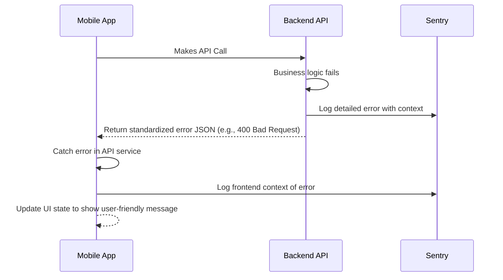

# **Error Handling Strategy**

A unified error handling strategy will be implemented to ensure consistency and provide clear, actionable feedback to both users and developers.



  * **Standard Error Format**:
    ```json
    {
      "error": {
        "code": "INVESTMENT_FAILED",
        "message": "Insufficient funds for this Power Up.",
        "requestId": "cuid_12345"
      }
    }
    ```
  * **Backend Middleware**: A global error handling middleware in Express will catch all unhandled exceptions and format them into the standard error response.
  * **Frontend Handling**: A wrapper around the API client will handle responses, directing successful ones to the application logic and failed ones to the error state management.

-----
