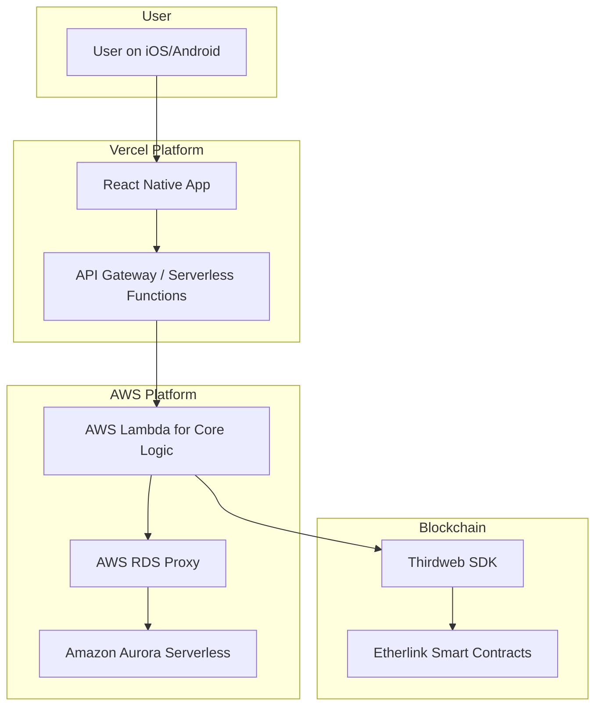

# **High Level Architecture**

## **Technical Summary**

STACK will be a fullstack, serverless, mobile-first application built on the Etherlink blockchain ecosystem. The architecture is housed in a monorepo and features a React Native frontend, a serverless backend connecting to an **Amazon Aurora Serverless** database via the **Prisma ORM**, and smart contracts managed via the Thirdweb SDK. This design directly supports the product's goals of creating a simple, gamified, and highly engaging user experience with flexible data querying.

## **Platform and Infrastructure Choice**

  * **Platform**: A hybrid approach using **Vercel** and **AWS**.
  * **Key Services**:
      * **Vercel**: For hosting the React Native web/API layer and providing preview deployments.
      * **AWS Lambda**: For intensive backend business logic.
      * **Amazon Aurora Serverless (PostgreSQL)**: For our primary relational database.
      * **AWS RDS Proxy**: To efficiently manage database connections from our Lambda functions.
  * **Rationale**: This combination offers a best-in-class developer experience for the frontend (Vercel) while leveraging the power of AWS for a scalable, relational backend.

## **Repository Structure**

  * **Structure**: **Monorepo**.
  * **Monorepo Tool**: **Turborepo** is recommended for its high-performance build system.
  * **Rationale**: A monorepo is ideal for managing shared code and types between the mobile app, backend, and smart contracts, as outlined in the PRD.

## **High Level Architecture Diagram**

## **Architectural Patterns**

  * **Serverless Architecture**: The entire backend will be event-driven and run in a serverless environment.
  * **Component-Based UI**: The React Native frontend will be built using a modular, reusable component architecture.
  * **API Gateway**: Vercel's serverless functions will act as a gateway, routing requests to the appropriate backend AWS Lambda services.
  * **Repository Pattern**: Backend services will use the repository pattern, implemented with **Prisma**, to abstract data access logic.

-----
